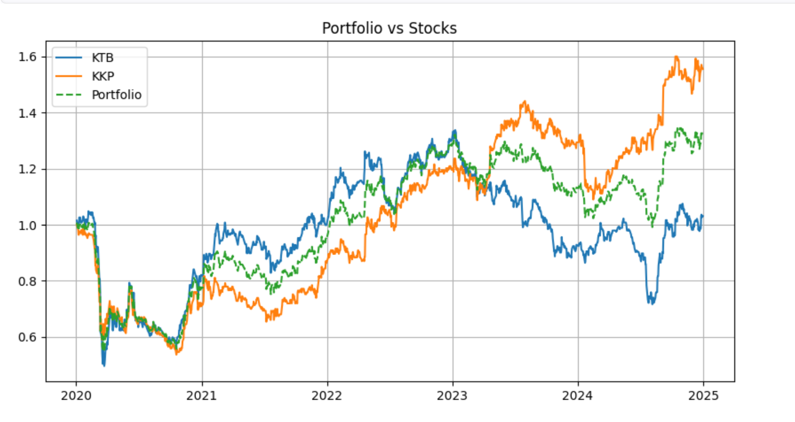

# equity-research-dashboard
# 📊 Equity Research & Portfolio Analysis Dashboard

This project presents a data-driven analysis of Thai banking stocks (KTB, KKP) using Python.

## 🚀 Objective
To evaluate stock performance and construct a portfolio based on risk-return tradeoff.

## 🛠️ Tools
- Python (Pandas, NumPy)
- Matplotlib
- yFinance

## 📈 Key Analysis
- Return & Volatility
- Correlation
- Sharpe Ratio
- Portfolio Construction

## 📊 Results & Insights
- KKP delivered higher returns but with higher volatility  
- KTB showed more stable performance  
- Portfolio diversification reduced overall risk  
- Risk-adjusted performance improved through portfolio construction  

## 📷 Sample Output

## ▶️ How to Run
pip install yfinance pandas numpy matplotlib  
python project.py
##
This analysis highlights the importance of balancing return and risk rather than focusing solely on performance.
